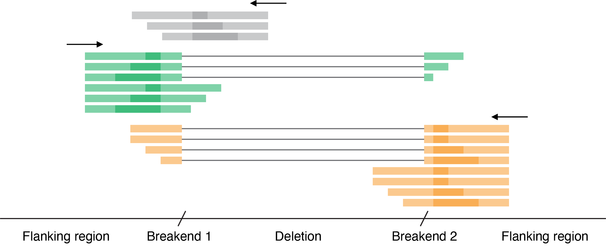

```{r, include=FALSE}
options(width=9999)
```

# Overview

The `SVseek` package analyses structural variants in candidate genes from genomic sequencing data. The software was developed for stranded data generated with a single-primer extension approach, but also supports non-stranded data from other assays. The package detects breakpoints from split reads and calculates variant allele fractions (VAFs).

```{r, include=FALSE}
library(SVseek)
library(ggbio)
```
# Background

Targeted sequencing assays using a single-primer extension approach, such as QIAseq (Lam et al. 2020), are well suited for analysing structural variants in candidate genes of interest. Primers flanking a structural variant can prime reads from both the rearranged and normal genomic sequence. The resulting variant-supporting and non-supporting reads can be used to calculate VAF estimates at each breakend (Figure 1). The software also supports analysis of non-stranded data from other assays, such as whole-genome sequencing.



Figure 1. Schematic of stranded reads from a single-primer extension assay for an intragenic genomic deletion. Primers are indicated by arrows. Informative reads from two primers upstream and downstream of the deletion are shown in green and orange, respectively. Grey reads for a primer targeting the deleted region are not used for analysis.

# Parsing a BAM file

`loadBAM` utilises `GenomicAlignments::readGAlignments` and
`GenomicRanges::GRanges` to process an input BAM file. The function filters
alignments, adds read information, and removes unnecessary seqlevels.
Argument `bounds` limits analysed reads. Here `bounds` is set to `genes` which includes two candidate genes of interest. Seqlevels of `bounds` must be consistent with the input BAM file. 

```{r}
genes <- GRanges(c(
    EWSR1 = "chr22:29662256-29698511:-",
    FLI1 = "chr11:128554429-128685162:-")
)
```
```{r, eval=FALSE}
gr <- loadBAM(input_bam, genes)
```
```{r, include = FALSE}
gr <- data_fusion$gr
```

Examples in this vignette are available as example data `data_fusion`.

# Breakpoint Operations

An arbitrary genomic rearrangement can be summarised by two breakends joined together in a novel adjacency (cf. VCF specifications). The `detectBreakpoints` function detects structural variants in specified candidate genes. Argument `genes` should include a single gene for intragenic variants or two genes for intergenic variants. In the example `detectBreakpoints` identifies a genomic rearrangement between two genomic loci specified in `genes`.
```{r}
breakpoint <- detectBreakpoints(gr, genes)[[1]]
breakpoint
```
The `detectBreakpoints` function can also be called with arguments `top_n`, `min_count` and/or `detect_reciprocal`. In the case of two genes, reciprocal rearrangements can be detected by specifying `detect_reciprocal = TRUE`. In the example a reciprocal fusion event cannot be detected. 

```{r}
detectBreakpoints(gr, genes, 3, 5, TRUE)
```

# Supporting and Non-supporting reads

Supporting and non-supporting reads can be retrieved as a list of read names using the
`getSupportingReads` and `getNonSupportingReads` functions, respectively.
```{r}
supporting_reads <- getSupportingReads(gr, breakpoint, "qiaseq")
nonsupporting_reads <- getNonSupportingReads(gr, breakpoint, "qiaseq")
```

These functions are wrappers for `selectReads` which requires arguments specifiying the minimal overlap for variant and flanking regions.

```{r}
supporting_reads <- selectReads(gr, breakpoint, "qiaseq", TRUE, 19, 19)
nonsupporting_reads <- selectReads(gr, breakpoint, "qiaseq", FALSE, 19, 19)
```

# VAF Calculation

`calculateVAF` calculates VAF estimates for each breakend, using functions
`getSupportingReads` and `getNonSupportingReads` internally.
Lists of reads can also be supplied as the optional arguments, `supp` and `nonsupp`.

```{r}
vaf <- calculateVAF(gr, breakpoint, "qiaseq")
vaf
```

The weighted average of breakend VAFs, weighted by total read
count, can be calculated using the `calculateWeightedAverage` function.
Using `calculateVAF` on a GRangesList of breakpoints will annotate
each breakpoint with the weighted average as a metadata column.

# Visualisation

`ggbio` can be used for visualisation, like so.

```{r, warning=FALSE}
# Prepare input for ggbio
grl <- GRangesList(vaf)
x <- unlist(endoapply(grl, "[", 1))
y <- unlist(endoapply(grl, "[", 2))
x$mate <- y
reference <- biovizBase::hg19sub
# Reformat seqlevels
x <- dropSeqlevels(x, c("chrM", "chrX", "chrY"))
x <- renameSeqlevels(x, as.character(1:22))
x$mate <- dropSeqlevels(x$mate, c("chrM", "chrX", "chrY"))
x$mate <- renameSeqlevels(x$mate, as.character(1:22))
ggbio() +
circle(reference, geom = "ideo", fill = "gray70") +
circle(reference, geom = "scale", size = 2) +
circle(reference, geom = "text", aes(label = seqnames), vjust = 0, size = 3) + 
circle(x, geom = "link", linked.to = "mate", color = "red", radius = 30)
```

# Example Data

There are two example datasets, `data_fusion` and `data_deletion`. Each object is a named list with the accessors:

* `$gr`: GRanges object from `loadBAM`
* `$breakpoint`: GRanges of breakpoints from the `getTopBreakpoints` utility function
* `$genes`: GRanges object of input genes for `detectBreakpoints`
* `$vaf`: Annotated GRanges from `calculateVAF`
* `$supporting_reads`: String list of supporting reads from `getSupportingReads`
* `$nonsupporting_reads`: String list of non-supporting reads from `getNonSupportingReads`

# References

* Lam SN, Zhou YC, Chan YM et al. Comparison of Target Enrichment Platforms for Circulating Tumor DNA Detection. Sci Rep 10, 4124, 2020. 
* The Variant Call Format Specification VCFv4.3 and BCFv2.2. https://github.com/samtools/hts-specs.

# Session Information

```{r, include=FALSE}
options(width=80)
```

```{r}
sessionInfo()
```
